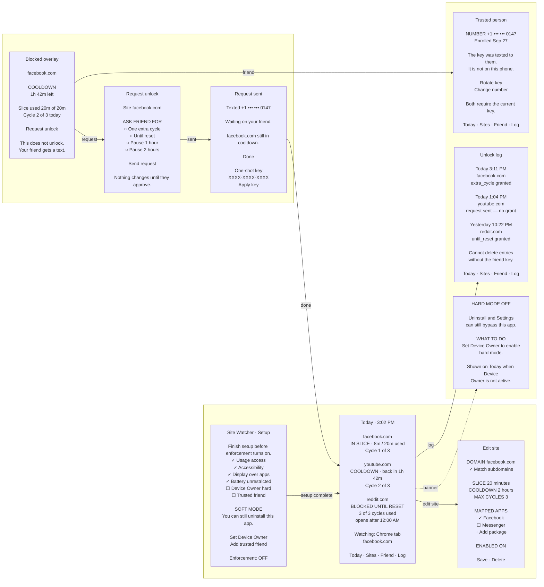

# App page mockups

Wireframes match the Lucid board (9 screens, 3×3).

Lucid: https://lucid.app/lucidchart/fe86db04-eeb2-4381-b45f-42b37b4bfc08/edit?page=0_0

## Flow

## Navigation

| From | Action | To |
|---|---|---|
| Setup | setup complete | Today |
| Today | edit site | Edit site |
| Today | Friend tab | Trusted person |
| Today | Log tab | Unlock log |
| Today | Device Owner missing | Hard mode off banner |
| Blocked overlay | Request unlock | Request unlock |
| Request unlock | Send request | Request sent |
| Request sent | Done | Today |

Bottom nav on Today, Trusted person, and Unlock log: **Today · Sites · Friend · Log**.

## Screen copy

Same content as the Lucid frames, kept here so the diagram and the board stay in sync.

### Setup

Finish setup before enforcement turns on.

- Usage access, Accessibility, Display over apps, Battery unrestricted: done
- Device Owner (hard), Trusted friend: not done
- Soft mode: you can still uninstall this app
- Actions: Set Device Owner, Add trusted friend
- Enforcement: OFF

### Today

- facebook.com — IN SLICE, 8m / 20m, cycle 1 of 3
- youtube.com — COOLDOWN, back in 1h 42m, cycle 2 of 3
- reddit.com — BLOCKED UNTIL RESET, 3 of 3, opens after 12:00 AM
- Watching: Chrome tab, facebook.com

### Edit site

facebook.com, match subdomains, slice 20m, cooldown 2h, max cycles 3, Facebook app mapped, enabled ON, Save / Delete.

### Blocked overlay

facebook.com cooldown, 1h 42m left, slice 20m of 20m, cycle 2 of 3. Request unlock does not unlock; friend gets a text.

### Request unlock

Grants: one extra cycle, until reset, pause 1 hour, pause 2 hours. Nothing changes until they approve.

### Request sent

Texted masked number. Site still in cooldown. Optional one-shot key field, not persisted.

### Trusted person

Masked number, enrolled date. Rotate key / change number both require the current key.

### Unlock log

Append-only. Cannot delete without the friend key.

### Hard mode off

Banner on Today when Device Owner is not active.
